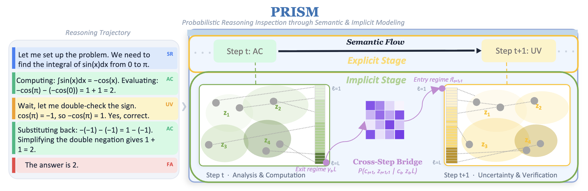

# PRISM: A Dual View of Reasoning — Semantic Flow and Latent Computation

This is the official implementation of PRISM: A Dual View of Reasoning — Semantic Flow and Latent Computation.

  

## 🌐 Demo

👉 [View Demo](https://RuidiChang.github.io/PRISM-arxiv/prism_demo/)
