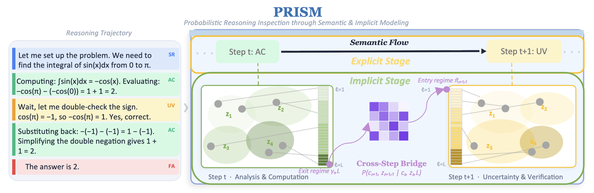

# PRISM: A Dual View of Reasoning through Semantic Flow and Latent Computation

This is the official implementation of PRISM: A Dual View of Reasoning through Semantic Flow and Latent Computation.

  

## 🌐 Demo

👉 [View Demo](https://agent-6a122b709e3380142ad07a6--jade-babka-69a618.netlify.app/)
